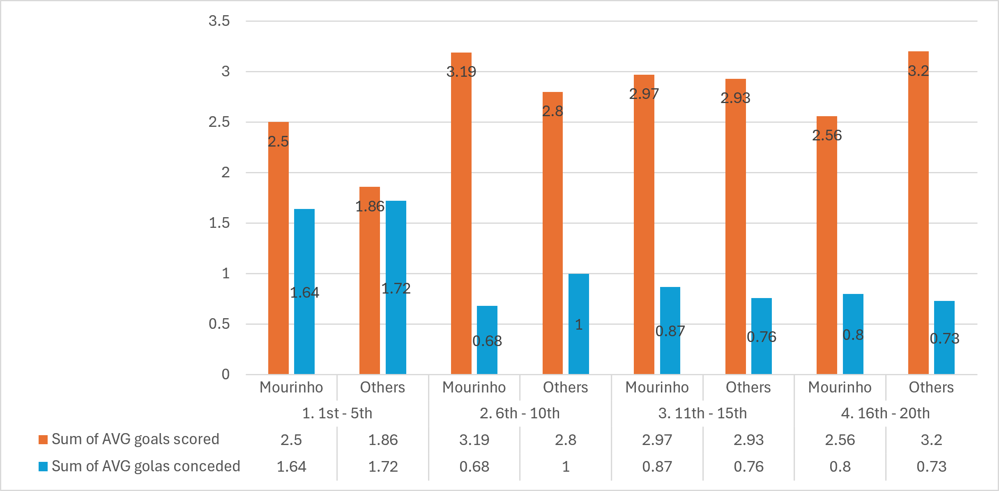
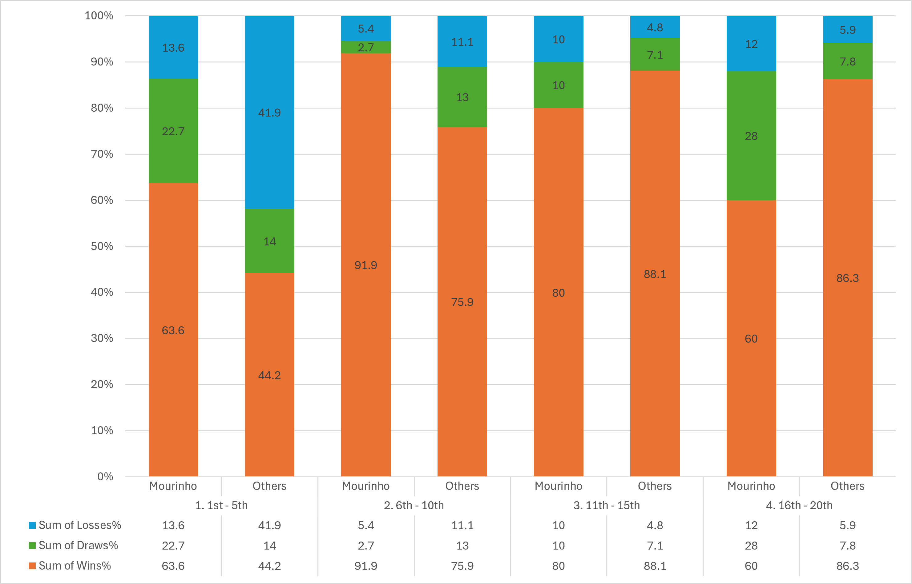

# Real Madrid CF — La Liga Performance Analysis
### Mourinho Era vs Other Managers (2008/2009 – 2015/2016)

---

## Project Overview
Analysis of Real Madrid's La Liga performance under José Mourinho 
(2010/2011 – 2012/2013) compared to other managers across seasons 
2008/2009 – 2015/2016. Focused specifically on win/draw/loss rates 
and average goals scored and conceded against opponents divided into 
four groups based on their league position at the time of each match.

---

## Question
Did Mourinho's Real Madrid perform significantly better or worse against 
certain opponent groups compared to other managers — and if so, 
which groups and by how much?

---

## Dataset
- **Source:** European Soccer Database (Kaggle)
- **Coverage:** La Liga seasons 2008/2009 – 2015/2016
- **Tables used:** Match, Team, Country
- **Tool:** DB Browser for SQLite

---

## Methodology
1. **Built a base results table** — extracted match outcomes, goals scored, 
goals conceded, stage and season for all La Liga matches between 
2008/2009 and 2015/2016.

2. **Added points per match** — assigned 3 points for a win, 1 for a draw 
and 0 for a loss. Necessary to build a cumulative league table rather 
than relying on final season standings.

3. **Built a stage-by-stage league table** — accumulated points, goals and 
goal difference for every team after each stage within each season. 
Final standings alone would not show how teams were performing at the 
time they faced Real Madrid.

4. **Ranked teams at each stage** — added league position to the table at 
every stage, necessary to extract each opponent's position before 
facing Real Madrid.

5. **Extracted position before the game** — used each opponent's ranking 
from the previous stage rather than their current stage position, to 
reflect their actual standing at the time of the match.

6. **Grouped opponents into four bands:**
   - **1st–5th:** Strongest opponents, competing for the title
   - **6th–10th:** Teams with ambitions to break into the top five
   - **11th–15th:** Mid-table sides, safe from relegation but not 
   competing for European spots
   - **16th–20th:** Teams fighting to stay in La Liga

---

## Key Findings

### Finding 1 — Goals pattern across opponent groups
Mourinho's Madrid scored more and conceded fewer goals against top 
and mid-table opponents (groups 1 and 2), with a particularly large 
goal difference advantage against the top 5. From group 3 onward the 
pattern reversed — Mourinho's side began conceding slightly more, and 
against bottom sides scored noticeably fewer goals than other managers.

### Finding 2 — Win, draw and loss rates by opponent group

---

## Conclusion
Mourinho's system was clearly optimized for elite opposition. Even while 
competing against Guardiola's Barcelona — arguably the strongest club 
side of that era — his win rate against top 5 opponents was significantly 
higher than other managers, with a near-dominant record against mid-table 
sides. However everything changed against the bottom two groups. Against 
defensive, relegation-threatened teams who sat deep and offered little 
space, Mourinho's Madrid struggled. The high draw rate against group 4 
suggests Madrid repeatedly dominated without finding a way through — 
a symptom of a system built around fast counter-attacks that became 
ineffective when opponents had no interest in attacking.

---

## Limitations
- Sample size difference: Mourinho 3 seasons (114 games), 
Others 5 seasons (190 games)
- Stage 1 opponent positions use current stage as fallback 
since no prior stage exists
- Opponent group bands are a simplification — quality varies 
within each band
- Database covers 2008/2009 – 2015/2016 only

---

## Files
- `real_madrid_mourinho_analysis.sql` — full pipeline including 
dynamic league table and manager era comparison

---

## Tools
- DB Browser for SQLite
- Microsoft Excel (charts and pivot tables for exploration)
